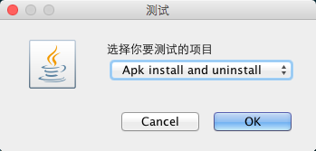

# Android-Monkeyrunner
Using [monkeyrunner](http://developer.android.com/tools/help/monkeyrunner_concepts.html) to test Launcher app

#How to use

###With monkeyrunner 
    monkeyrunner a.py

###Use makefile
- Add `monkeyrunner` to your PATH. It means you can run monkey runner directly in command line.
- Run `Make` in command line.

#Screenshot

